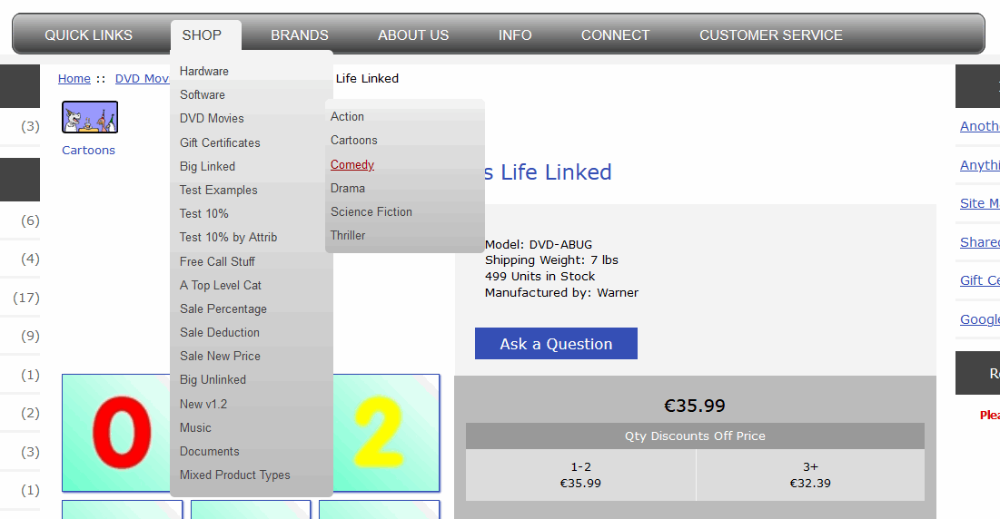

# Zen Cart - Pure CSS Mega Menu
Based on original Picaflor Azul contribution: https://www.zen-cart.com/downloads.php?do=file&id=1554  
Forum Thread: https://www.zen-cart.com/showthread.php?202140-Pure-CSS-Mega-Menu  
GitHub: https://github.com/torvista/Zen_Cart-Pure_CSS_Mega_Menu

<<<<<<< HEAD
## Changelog
26/03/2024 torvista  
Bigfix: misdeclared and missing constants in headermenu.php  
Fix: PHP Warning: Undefined array key "customer_id" in   includes\templates\responsive_classic\common\tpl_mega_menu.php  
Fix: PHP Warning: Undefined variable $show_ezpages_header in \includes\modules\sideboxes\responsive_classic\ezpages_drop_menu.php  
IDE recommendations
=======
## Function
Provides a multi-level dropdown menu of just about anything.

Screenshot of original styling:

### Installation
[See original info in /readme](readme/pure_css_mega_menu_readme.html)

## Changelog
26/03/2024 torvista  
Fix: misdeclared and missing constants in headermenu.php  
Fix: PHP Warning: Undefined array key "customer_id" in includes\templates\responsive_classic\common\tpl_mega_menu.php  
Fix: PHP Warning: Undefined variable $show_ezpages_header in \includes\modules\sideboxes\responsive_classic\ezpages_drop_menu.php  
IDE recommendations, formatting
>>>>>>> 3adbe238b044cb733ce5e2531f2ce0e933783938

15/11/2012 v1.0 Picaflor-Azul Plugins
https://www.zen-cart.com/downloads.php?do=file&id=1554
